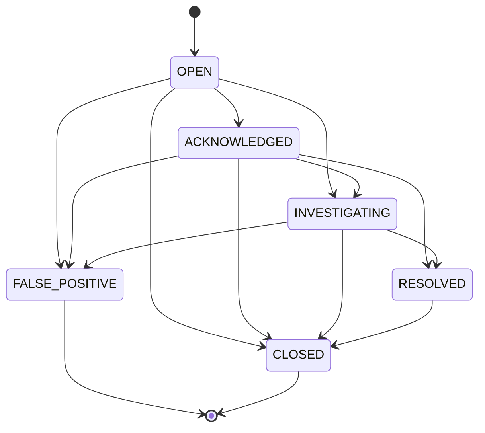
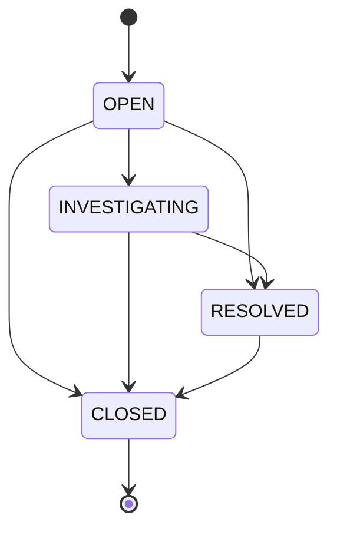

# SentinelFlow — Detection Engine

Two fully independent detection paths run on every persisted event, inside `EventProcessingService.process()`. Neither can silence the other: the rule path never calls the ML client and never throws out of its own evaluation; the ML path's failure is caught and recorded without ever touching the rule path (which already ran, earlier in the same call).

## A. ML detection

```
Event -> MlPredictionClient.predict() -> MlPredictionResponse
      -> EventProcessingService.mapDecision() -> DecisionState
      -> PredictionService.create() -> Prediction row
      -> PredictionService.shouldCreateAlert() (fusedScore >= alert-threshold)
      -> Alert (decision = KNOWN_ANOMALY | UNKNOWN_ANOMALY, prediction != null, ruleId = null)
```

See `../ml/ml-integration.md` for the full request/response contract, decision mapping, and threshold rationale.

## B. Deterministic rules

Source: `backend/backend/src/main/java/com/anomaly/platform/service/DeterministicRuleService.java`. Policy version stamped on every rule-raised alert: `"rules-v1"`.

Entry point `evaluate(Event)` dispatches purely on `eventType`:

```
"LOGIN"              -> evaluateAuthBurst(event)
"NETWORK_CONNECTION" -> evaluateNewProcessExternalConnection(event)
(anything else)      -> no rule runs
```

### Rule: `AUTH_BURST`

| | |
|---|---|
| Rule ID | `AUTH_BURST` |
| Rule name | "Repeated failed login attempts" |
| Trigger | A `LOGIN` event whose own `payload.loginSuccess == false` |
| Window | 5 minutes (`AUTH_BURST_WINDOW_MINUTES`) ending at the triggering event's own `occurredAt` |
| Threshold | ≥ 5 failed `LOGIN` events for the same `entityId` within the window (`AUTH_BURST_THRESHOLD`) |
| Severity | `MEDIUM` below 10 failures, `HIGH` at ≥ 10 (`AUTH_BURST_HIGH_THRESHOLD`) |
| Evidence | `"<N> failed login attempts for <entityId> within 5m (threshold 5)."`, truncated to 128 chars |
| Suppression | If an `OPEN`/`ACKNOWLEDGED`/`INVESTIGATING` `AUTH_BURST` alert already exists for this entity, no new alert is raised — a `DETECTION_SUPPRESSED` audit entry is written instead, and the triggering event remains fully persisted and visible |
| Idempotency | `AlertRepository.existsByEvent_IdAndRuleId(eventId, "AUTH_BURST")` — this exact event cannot fire the rule twice |
| Audit | `DETECTION_CREATED` (on fire) or `DETECTION_SUPPRESSED` (on suppression), both on the `ALERT` resource |

Never fires from physical-collector telemetry today — session polling can only observe an *already-active* session, so a failed login attempt produces no session and is invisible to that source (see `../telemetry/physical-telemetry.md` §13). Fires only from `LOGIN` events that genuinely report `loginSuccess: false` (the Python simulator's `suspicious`/`high`/`critical` scenarios, or the in-console Simulator's "Brute-force login burst" scenario).

### Rule: `NEW_PROCESS_EXTERNAL_CONNECTION`

| | |
|---|---|
| Rule ID | `NEW_PROCESS_EXTERNAL_CONNECTION` |
| Rule name | "New process established a non-loopback network connection" |
| Trigger | A `NETWORK_CONNECTION` event with a numeric `payload.pid`, a string `payload.processCreateTime`, and a non-loopback `payload.remoteAddress` |
| Correlation | Exact match, no time tolerance: a `PROCESS_START` event for the same `entityId` whose `payload.pid == pid` and whose own `occurredAt` (formatted `yyyy-MM-dd'T'HH:mm:ss'Z'`, UTC) equals the connection's `processCreateTime` string |
| Recency bound | The correlated `PROCESS_START` must be within 5 minutes (`NEW_PROCESS_CONNECTION_RECENCY_MINUTES`) before the connection — otherwise it does not fire (an old process's connection is not a meaningful signal) |
| Severity | Always `MEDIUM` |
| Evidence | `"Process <name or 'pid <n>'> connected to <remoteAddress> <n>m after creation."`, truncated to 128 chars |
| Suppression | None — this rule has no "active alert already exists" check; every qualifying connection can raise its own alert (each is idempotent per-event, see below) |
| Idempotency | `AlertRepository.existsByEvent_IdAndRuleId(eventId, "NEW_PROCESS_EXTERNAL_CONNECTION")` |
| Audit | `DETECTION_CREATED` on the `ALERT` resource |

Deliberately neutral, observation-only naming and evidence text — "established a network connection shortly after creation", never "malware" or any other verdict. Loopback remote addresses (`127.`, `::1`, `localhost`) never trigger this rule.

## C. Shared alert-raising path

Both `PredictionService.create` (ML) and `DeterministicRuleService.raiseAlert` (rules) create an `Alert`, attach it to an incident via `IncidentService.findOrCreateIncident`, write ranked `AlertFactor` rows, and write an audit entry — the same underlying sequence, so every existing alert/incident list, filter, and lifecycle transition works identically for a rule-raised alert with zero additional code. The only structural differences: a rule alert's `prediction` is always `null`, its `ruleId`/`ruleName` are set, and its `decision` is always `DecisionState.SUSPICIOUS` — a value the ML mapping never produces (see `../ml/ml-integration.md` §5), making a rule alert trivially, unambiguously distinguishable from an ML alert by `decision` alone, and explicitly via the derived `detectionType` field (`"RULE"` vs `"ML"`) everywhere the API surfaces it.

## D. Alert status lifecycle

`AlertService.allowed(from, to)` — the only legal transitions:



An illegal transition throws `InvalidStatusTransitionException` → `409 INVALID_STATUS_TRANSITION`. A same-status "transition" is a no-op (no new audit entry, no version bump). `ACKNOWLEDGED` sets `acknowledgedAt`; `RESOLVED`/`CLOSED`/`FALSE_POSITIVE` sets `resolvedAt`.

## E. Incident status lifecycle

`IncidentService.allowed(from, to)`:



Moving an incident to `RESOLVED` or `CLOSED` **synchronizes every linked alert**: each still-active alert (`OPEN`/`ACKNOWLEDGED`/`INVESTIGATING`) is moved to `RESOLVED` or `CLOSED` respectively, each with its own audit entry (`source: "INCIDENT_STATUS_SYNCHRONIZATION"`). Moving to `INVESTIGATING` moves each `OPEN`/`ACKNOWLEDGED` alert to `INVESTIGATING`. This synchronization is flushed explicitly (`alertRepository.saveAll(...); alertRepository.flush();`) so a concurrent direct `PATCH` on one of those same alerts is caught as a version conflict and rolls back the whole incident-status change atomically, rather than silently overwriting it.

## F. Correlation into incidents

`IncidentService.findOrCreateIncident` keys an incident on `entityId:eventType` (the alert's originating event type, or `"UNKNOWN"` if the alert has no linked event). If an active (`OPEN`/`INVESTIGATING`) incident already exists under that key, the new alert joins it. If the base-key incident is `RESOLVED`/`CLOSED`, the method first checks for an already-open **follow-up** incident under a timestamp-suffixed key (`entityId:eventType:<epoch_ms>`) before creating yet another one — so a burst of alerts after the original incident closed correctly joins one follow-up incident, not one each. The insert itself runs in a `REQUIRES_NEW` transaction relying on the DB's own unique constraint on `incident_key`, so two concurrent alerts racing to create the same new incident cannot both succeed — the loser simply re-reads the winner's row.
