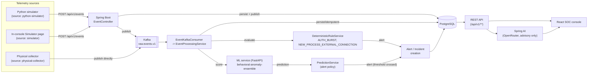

# SentinelFlow — System Architecture

## 1. Project overview

SentinelFlow is a streaming behavioural-anomaly-detection platform. Telemetry events (logins, process starts, network connections, file access, transactions, and similar security-relevant activity) are ingested from multiple sources, persisted, scored by a trained ML ensemble, independently checked against a small set of deterministic rules, and — when either path finds something worth an analyst's attention — turned into an **Alert**, grouped into a correlated **Incident**, and surfaced in a React "SOC" (security-operations-console) web application. An optional Spring AI layer lets an analyst ask for a plain-English explanation, evidence summary, or investigation suggestion for an alert or incident, strictly as read-only, advisory text over evidence the platform already computed.

## 2. Problem being addressed

A SOC analyst facing a stream of raw activity events needs three things a plain log viewer does not give them: (1) an automatic, standing judgement of which events are anomalous, (2) correlation of related alerts into a single investigable incident rather than a flood of disconnected rows, and (3) fast, evidence-grounded explanations of *why* something was flagged. SentinelFlow addresses all three, and — critically — does not depend on a single point of failure for detection: an ML model outage does not silence the entire platform, because a second, independent deterministic rule engine keeps evaluating every event regardless of ML availability.

## 3. System objectives

- Ingest canonical security events from more than one real source (a Python event simulator, a live Windows physical-telemetry collector, and the SOC console's own in-browser scenario simulator) without those sources needing to agree on anything beyond one shared JSON envelope.
- Never silently drop an accepted event: every event ends up `PROCESSED` or `FAILED` with a recorded reason, and is always readable.
- Score every event with a real, trained ML ensemble (`ml-service/anomaly-detection`), while never letting an ML outage prevent an independent, deterministic backstop from firing.
- Turn qualifying detections into Alerts, automatically correlate related alerts for the same entity/event-type into an Incident, and let an analyst move both through an audited, validated status lifecycle.
- Provide optional, tightly-grounded AI assistance (explanation / evidence summary / investigation) that is structurally incapable of mutating any system state.
- Enforce authentication and role-based authorization (`ADMIN` / `ANALYST`) on every endpoint that is not deliberately public.

## 4. High-level architecture

## 5. Major components

| Component | Path | Responsibility |
|---|---|---|
| Physical collector | `SentinelFlow-PhysicalCollector/` | Polls a real Windows host (psutil) for LOGIN/LOGOUT, PROCESS_START, NETWORK_CONNECTION; publishes directly to Kafka |
| Python simulator | `simulator/simulator/` | Generates synthetic event sequences (`normal`/`suspicious`/`high`/`critical`/`mixed`/`burst`/`historical`) and POSTs them to the REST API |
| In-console Simulator | `frontend/src/pages/Simulator.tsx` | Six canned browser-triggered scenarios (routine, brute-force, impossible travel, privilege escalation, exfiltration, unknown device), POSTed via the signed-in analyst's own session |
| Backend | `backend/backend/` | Spring Boot 3.3 / Java 21: REST API, Kafka consumer/producer, JPA persistence, ML client, deterministic rule engine, alert/incident lifecycle, security, audit log, Spring AI layer |
| ML service | `ml-service/anomaly-detection/` | FastAPI service wrapping a trained scikit-learn/PyTorch/LightGBM ensemble (`models/pipeline.joblib`); exposes `POST /predict` and `GET /health` |
| PostgreSQL | Docker (`docker-compose.yml`) | System of record: entities, events, predictions, alerts, alert factors, incidents, audit logs, replay runs, model versions, feature snapshots |
| Kafka | Docker (`docker-compose.yml`) | `raw.events.v1` (+ `raw.events.v1.DLT` dead-letter topic) — the single event bus every source ultimately reaches |
| React SOC | `frontend/` | Analyst-facing console: dashboard, events, predictions, alerts, incidents, entities, simulator, replay runs (admin), audit logs (admin), system status |

## 6. Responsibilities of each component

- **Telemetry sources** only ever produce the canonical event envelope (`eventId`, `entityId`, `eventType`, `eventVersion`, `occurredAt`, `source`, `payload`). None of them decide anomaly status — that is deliberately kept out of every producer.
- **Backend** is the sole owner of persistence, detection orchestration, alert/incident lifecycle, and authorization. It calls the ML service as an external dependency, never embeds ML logic itself, and never lets a rule engine or AI layer mutate anything outside their narrow, explicit responsibility.
- **ML service** only scores one event at a time and reports its own model's output field-for-field (`anomalyScore`, `decision`, `attackType`, `confidence`, `reason`, `factors`). It does not decide severity or alert policy — that stays in Spring Boot (`PredictionService`, `AlertPolicyProperties`).
- **Spring AI layer** (`ai/` package) has no repository, ML client, or alert/incident-mutation dependency in its constructors — it is structurally incapable of changing a score, decision, severity, or status.
- **React SOC** only reads the REST API and only writes through the two explicit, validated status-transition endpoints (`PATCH /alerts/{id}/status`, `PATCH /incidents/{id}/status`) plus event creation and AI-generation calls (all read-only for state).

## 7. Data flow

1. A source builds a canonical event and either publishes it directly to `raw.events.v1` (physical collector) or `POST`s it to `/api/v1/events` (simulator, in-console simulator, or any REST caller), which itself both persists the event row and publishes to Kafka.
2. `EventKafkaConsumer` consumes the topic and calls `EventProcessingService.process(event)`, which persists/loads the event idempotently (`EventProcessingLedgerService`, keyed on `eventId`), then runs **both** detection paths unconditionally: `DeterministicRuleService.evaluate(...)` and a call to the ML service.
3. The ML response is mapped into a `Prediction` and, if the alert-policy threshold is crossed, an `Alert` (`PredictionService`). A firing deterministic rule raises its own `Alert` directly (`DeterministicRuleService`), independent of the ML outcome.
4. Every alert is attached to an `Incident`, found or created by `entityId:eventType` correlation key (`IncidentService.findOrCreateIncident`).
5. The React SOC reads all of this through versioned REST endpoints and lets an analyst move alerts/incidents through a validated status lifecycle, optionally requesting an AI explanation/summary/investigation for context.

See `event-flow.md` for the full field-by-field trace and a sequence diagram.

## 8. Trust / control boundaries

- **Public, unauthenticated**: `GET /api/v1/health`, `GET /actuator/health`, `POST /api/v1/events` (the simulator and physical collector have no auth support, so this endpoint stays public by explicit design decision — see `../security/security-design.md`).
- **ANALYST or ADMIN**: everything else under `/api/v1/**` by default (read events/predictions/alerts/incidents/dashboard/entities, and the two status-transition endpoints).
- **ADMIN only**: creating entities, direct prediction insertion (`POST /api/v1/predictions`, bypasses the real ML pipeline), replay runs, the audit log, and `/actuator/**` beyond health.
- **ML service**: trusted as a detection input, but its output is never blindly trusted as final — Spring Boot's own alert policy (thresholds, severity bands) decides whether and how loudly to alert.
- **Spring AI / OpenRouter**: treated as an external, potentially unavailable or adversarial-input-exposed dependency. Every value that ultimately traces back to the public `POST /api/v1/events` endpoint is sanitized and wrapped in explicit `<<<EVIDENCE>>>` delimiters before it ever reaches a prompt (see `../ai/spring-ai.md`).

## 9. Runtime architecture

Everything runs as independent host-side or containerized processes on one machine for this project's current deployment: PostgreSQL and Kafka run in Docker (`docker-compose.yml`); the Spring Boot backend, ML service, physical collector, and frontend dev server run directly on the host. See `../../README.md` for exact startup commands and `docker-compose.yml` for the two containerized services' configuration.

## 10. Simulator vs physical telemetry

Three distinct producers exist, distinguished by the `source` field they stamp on every event — nothing downstream infers source from event content:

| Source literal | Producer | Transport | What it generates |
|---|---|---|---|
| `python-simulator` | `simulator/simulator/simulator.py` | REST (`POST /api/v1/events`) | Synthetic multi-step scenarios (`normal`, `suspicious`, `high`, `critical`, `mixed`, `burst`, `historical`) across `LOGIN`/`API_ACCESS`/`FILE_ACCESS`/`TRANSACTION`/`LOGOUT`/`PASSWORD_CHANGE` |
| `physical-collector` | `SentinelFlow-PhysicalCollector/collector/main.py` | Direct Kafka publish | Real host telemetry: `LOGIN`/`LOGOUT` (session polling), `PROCESS_START` (process polling), `NETWORK_CONNECTION` (network polling) — genuinely observed, never fabricated |
| `simulator` | `frontend/src/pages/Simulator.tsx` (in-browser) | REST, via the signed-in analyst's own session | Six fixed demo scenarios (`routine`, `brute`, `travel`, `privesc`, `exfil`, `device`) |

The physical collector never claims to detect anomalies itself — see `../telemetry/physical-telemetry.md` for the precise observed/determined boundary.

## 11. ML vs deterministic detection

Two fully independent detection paths run on every persisted event inside `EventProcessingService.process()`:

1. **ML path**: `MlPredictionClient.predict(...)` → `PredictionService.create(...)`, gated by `anomaly.alert-policy.alert-threshold` (`application.yml`).
2. **Deterministic rule path**: `DeterministicRuleService.evaluate(...)`, which never calls the ML client and never throws out of its own `evaluate()` (wrapped in its own try/catch, and again by the caller) — an ML outage cannot silence it, and a rule bug cannot break event processing or the ML path.

A rule-raised alert reuses the exact same `Alert`/`Incident`/`AlertFactor`/`AuditLog` machinery as an ML-raised alert; the only structural differences are `prediction` staying `null`, `ruleId`/`ruleName` being set, and `decision` using `DecisionState.SUSPICIOUS` (a value the ML mapping never produces). See `detection-engine.md`.

## 12. Alert / incident flow

An alert is created either by `PredictionService.create` (ML path, when `fusedScore >= alert-threshold`) or by `DeterministicRuleService.raiseAlert` (rule path). Either way, `IncidentService.findOrCreateIncident` attaches it to an incident keyed on `entityId:eventType` (reusing an active `OPEN`/`INVESTIGATING` incident, or opening a new, timestamp-suffixed one once the prior incident under that key is resolved/closed). Incident status changes (`PATCH /incidents/{id}/status`) synchronize every linked alert's status accordingly (`IncidentService.synchronizeAlerts`). See `../database/database-design.md` for the schema and `detection-engine.md` / `event-flow.md` for the full lifecycle.

## 13. Spring AI role

Spring AI (`ai/` package, `IncidentAiService`/`AlertAiService`) is an **analyst-assistance / investigation layer only**. It is grounded exclusively in evidence SentinelFlow's own ML model, rule engine, and alert policy already produced; it cannot detect anomalies itself, cannot recalculate a score or decision, and cannot mutate alert or incident state — enforced structurally (no such dependency exists in its constructor), not merely by instruction. See `../ai/spring-ai.md`.

## 14. React SOC role

The frontend (`frontend/`) is a read-heavy operations console: dashboard, event/prediction/alert/incident/entity browsing with detail drawers, a command palette, light/dark themes, and the two demo-oriented simulators (in-console scenario buttons, and a dedicated Simulator page). It never computes detection results itself — every score, decision, severity, and correlation shown is read verbatim from the backend. See `soc-dashboard.md`.
