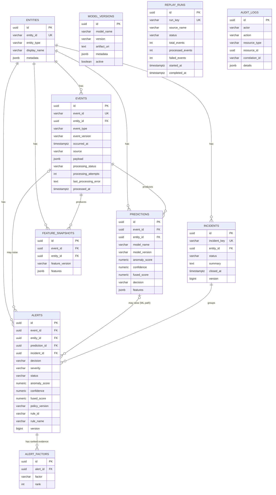

# SentinelFlow — Database Design

PostgreSQL 16. Schema is managed entirely by Flyway migrations under `backend/backend/src/main/resources/db/migration/`, `V1` through `V14`. `spring.jpa.hibernate.ddl-auto: validate` — Hibernate never generates DDL; Flyway is the only source of schema truth.

## 1. Migration history (V1 → V14)

| Migration | Change |
|---|---|
| `V1__create_entities.sql` | `entities` table (+ `pgcrypto` extension for `gen_random_uuid()`) |
| `V2__create_events.sql` | `events` table |
| `V3__create_model_versions.sql` | `model_versions` table |
| `V4__create_feature_snapshots.sql` | `feature_snapshots` table |
| `V5__create_predictions.sql` | `predictions` table |
| `V6__create_incidents.sql` | `incidents` table |
| `V7__create_alerts.sql` | `alerts` table |
| `V8__create_alert_factors.sql` | `alert_factors` table |
| `V9__create_replay_runs.sql` | `replay_runs` table |
| `V10__create_audit_logs.sql` | `audit_logs` table |
| `V11__add_prediction_idempotency.sql` | Unique constraint `(event_id, model_name, model_version)` on `predictions` |
| `V12__add_event_processing_status.sql` | Adds `processing_status`, `processing_attempts`, `last_processing_error`, `processed_at` to `events` |
| `V13__add_alert_rule_fields.sql` | Adds nullable `rule_id`, `rule_name` to `alerts` (independent deterministic detection) |
| `V14__add_optimistic_locking.sql` | Adds `version BIGINT NOT NULL DEFAULT 0` to `alerts` and `incidents` (optimistic locking) |

## 2. Entity-relationship diagram

`MODEL_VERSIONS`, `REPLAY_RUNS`, and `AUDIT_LOGS` are intentionally shown without relationship lines above: `model_versions` is a standalone registry table with no FK from any other table pointing into it (not currently wired into the prediction path — see "Not verified from source" below); `replay_runs` tracks bulk-reprocessing jobs by `run_key` with no FK to individual events; `audit_logs.resource_id` is a loosely-typed UUID reference (no DB-level FK) resolved by `resource_type` at the application layer, deliberately, so an audit entry survives even if the referenced row is later deleted.

## 3. Tables in detail

### `entities`
Primary keys/uniques: `id` (UUID PK), `entity_id` (unique, e.g. `USER-001`, `HOST-LAPTOP-XXXX`). Index: `entity_type`. `metadata` is a free-form `jsonb` map, default `{}`.

### `events`
PK `id`; unique `event_id`. FK `entity_id → entities(id)`, `NOT NULL`. Indexes: `(entity_id, occurred_at DESC)`, `(event_type, occurred_at DESC)`, `processing_status` (added in `V12`). `payload` is `jsonb NOT NULL DEFAULT '{}'`. Processing lifecycle columns added in `V12` (see above).

### `predictions`
PK `id`. FKs `event_id → events(id)`, `entity_id → entities(id)`, both `NOT NULL`. `anomaly_score`/`confidence`/`fused_score` are `NUMERIC(6,5)` with `CHECK` constraints bounding them to `[0,1]`. `decision` is a plain `VARCHAR` at the DB level, mapped to the `DecisionState` enum (`NORMAL`, `SUSPICIOUS`, `KNOWN_ANOMALY`, `UNKNOWN_ANOMALY`, `ERROR`) in Java. Unique constraint `(event_id, model_name, model_version)` added in `V11` for idempotency. Indexes: `(entity_id, created_at DESC)`, `event_id`.

### `incidents`
PK `id`; unique `incident_key` (format `entityId:eventType`, or `entityId:eventType:<epoch_ms>` for a follow-up incident once the base-key incident is resolved/closed — see `IncidentService.findOrCreateIncident`). FK `entity_id → entities(id)` (nullable). `status` maps to `IncidentStatus` (`OPEN`, `INVESTIGATING`, `RESOLVED`, `CLOSED`). `version` (added in `V14`) backs JPA optimistic locking (`@Version` on `Incident.java`). Index: `(entity_id, status)`.

### `alerts`
PK `id`. FKs: `event_id → events(id)` (nullable — a rule-raised alert's originating event is still linked, but the column is nullable by original design), `entity_id → entities(id)` (`NOT NULL`), `prediction_id → predictions(id)` (nullable — **null for every rule-raised alert**, by construction), `incident_id → incidents(id)` (nullable until correlation runs, which happens synchronously in the same request/transaction). `decision` maps to `DecisionState`; `severity` to `Severity` (`LOW`/`MEDIUM`/`HIGH`/`CRITICAL`); `status` to `AlertStatus` (`OPEN`/`ACKNOWLEDGED`/`INVESTIGATING`/`RESOLVED`/`FALSE_POSITIVE`/`CLOSED`). `rule_id`/`rule_name` (added in `V13`) are non-null only for a deterministic-rule alert; the application derives `detectionType` as `"RULE"` when `rule_id` is present, `"ML"` otherwise — this is **never stored**, only computed at read time (see `AlertResponse`/`IncidentAlertResponse`). `version` (added in `V14`) backs optimistic locking. Indexes: `(status, created_at DESC)`, `(severity, status)`, `(entity_id, created_at DESC)`, `incident_id`, `rule_id`.

### `alert_factors`
PK `id`. FK `alert_id → alerts(id) ON DELETE CASCADE`. `factor` is `VARCHAR(128) NOT NULL` — both the ML path (`PredictionService.determineFactors`) and the rule path (`DeterministicRuleService.truncateFactor`) explicitly truncate evidence text to fit this bound rather than risk a DB error. `rank` is a positive integer; unique `(alert_id, rank)`. Index: `(alert_id, rank)`.

### `model_versions`
PK `id`. Unique `(model_name, version)`. `active` boolean + index `(model_name, active)` — intended as a registry of which trained model version is "live", though the current `MlPredictionClient`/`api.py` integration reports `modelName`/`modelVersion` directly from the ML service's own response on every call rather than reading this table. **Not verified from source**: no code path in `backend/backend` was found that writes to or reads from `model_versions` today.

### `feature_snapshots`
PK `id`. FKs `event_id → events(id)`, `entity_id → entities(id)`. `features` is `jsonb`. Indexes: `(entity_id, created_at DESC)`, `event_id`. **Not verified from source**: no service class was found that writes a `FeatureSnapshot` row in the current codebase — the entity and repository exist, but the write path (if any) was not located in this pass.

### `replay_runs`
PK `id`. Unique `run_key`. `status` maps to `ReplayRunStatus`. Tracks `total_events`/`processed_events`/`failed_events` and start/completion timestamps for a bulk reprocessing job (`ReplayRunService`, ADMIN only).

### `audit_logs`
PK `id`. `actor` (username, or `"system"` for pipeline-originated entries), `action` (e.g. `STATUS_CHANGED`, `DETECTION_CREATED`, `DETECTION_SUPPRESSED`, `INCIDENT_CREATED`, `EVENT_PROCESSING_FAILED`, `EVENT_PERSIST_FAILED`), `resource_type` + `resource_id` (loosely typed, no FK), `correlation_id` (ties back to the originating request's `X-Correlation-Id`), `details` (`jsonb`, free-form). Indexes: `(resource_type, resource_id, created_at DESC)`, `correlation_id`.

## 4. Enums / state fields (Java-side)

| Enum | Values | Backs |
|---|---|---|
| `DecisionState` | `NORMAL`, `SUSPICIOUS`, `KNOWN_ANOMALY`, `UNKNOWN_ANOMALY`, `ERROR` | `predictions.decision`, `alerts.decision` — `SUSPICIOUS` is reserved exclusively for the rule path; the ML mapping never produces it |
| `Severity` | `LOW`, `MEDIUM`, `HIGH`, `CRITICAL` | `alerts.severity` |
| `AlertStatus` | `OPEN`, `ACKNOWLEDGED`, `INVESTIGATING`, `RESOLVED`, `FALSE_POSITIVE`, `CLOSED` | `alerts.status` |
| `IncidentStatus` | `OPEN`, `INVESTIGATING`, `RESOLVED`, `CLOSED` | `incidents.status` |
| `EventProcessingStatus` | `PENDING`, `PROCESSED`, `FAILED` | `events.processing_status` |
| `ReplayRunStatus` / `ReplayStatus` | — | `replay_runs.status` |

## 5. Optimistic locking

`Alert.version` and `Incident.version` (`@Version`, `BIGINT NOT NULL DEFAULT 0`, added in `V14__add_optimistic_locking.sql`) back JPA optimistic locking. Every status mutation (`AlertService.updateStatus`, `IncidentService.updateStatus`, and the alert rows an incident status change synchronizes) uses `saveAndFlush`/an explicit `flush()` specifically so a genuine concurrent conflicting update is detected inside that request as an `ObjectOptimisticLockingFailureException` — mapped by `GlobalExceptionHandler` to `409 CONCURRENT_MODIFICATION` — rather than one of the two concurrent updates being silently lost. The migration's own comment records that this was confirmed as a real, live bug (two concurrent `PATCH .../status` calls both returning `200`, only one taking effect, both recorded in the audit log) before the fix was written.
